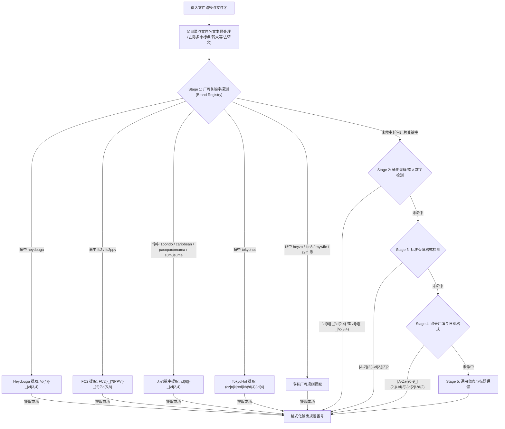

# 番号分层提取（厂牌优先）与欧美数据库（StashDB/ThePornDB）严格匹配设计规范

- **状态**: 草案待评审 (Draft for Review)
- **创建日期**: 2026-09-10
- **关联组件**: `mdcx/number.py`, `mdcx/core/file_crawler.py`, `mdcx/crawlers/stashdb.py`, `mdcx/crawlers/theporndb.py`

---

## 1. 背景与根因剖析

### 1.1 典型误刮削事故复盘
在 2026-09-10 的批量刮削测试中，样本文件：
- 文件路径: `I:\Incoming\Vdo\scan\input\heydouga 4037-531\heydouga 4037-531-real interview 316 Towa01.wmv`
- 实际内容: 日本无码素人厂牌 HeyDouga，番号 `4037-531`
- 刮削输出: 欧美片 `GangBang Creampie 316 Interview`（女优: Daisie Belle），被挪动至 `output\Daisie Belle\INTERVIEW-316\`

### 1.2 根因分析：双重机制漏洞交织
1. **番号提取器（`mdcx/number.py`）顺序与覆盖缺陷**：
   - 现有 `get_file_number` 提取流程中，标准有码正则 `[A-Z]{2,}-\d{2,}` 排在无码/素人双数字正则 `\d{2,}[-_]\d{2,}` **之前**。
   - 文件名经过清理后留下 `-4037-531-REAL-INTERVIEW-316-TOWA01.`，正则引擎从左向右扫描，在遇到 `\d{2,}[-_]\d{2,}` 前，先被 `[A-Z]{2,}-\d{2,}` 抢先命中了 `INTERVIEW-316`（将其视作日本厂商有码番号）。
   - 现存的 `UNCENSORED_DIGIT_NUMBER_PATTERN` 仅匹配 6 位纯数字（如 `\d{6}[-_]\d{2,4}`），不匹配 Heydouga 的 4 位前缀（`4037-531`），且依赖 `fullmatch`，一旦文件名带有额外文字描述即失效。
2. **欧美刮削源分类隔离失效与低门槛文本兜底**：
   - 当 `INTERVIEW-316` 在日系网站全部 404 后，任务降级轮询到配置在 `website_youma` 中的 `stashdb`。
   - StashDB 的 pHash / OSHash 未中，随后执行 GraphQL 文本模糊查询 `{"input": {"text": "interview 316"}}`。
   - 欧美库中有海量包含 `Interview` 词汇的场景，检索返回 `GangBang Creampie 316 Interview`。
   - 当前打分函数仅计算分词重合度（命中 `interview` 和 `316` 两个词即得 50 分），在**缺乏最低准入门槛、无厂牌一致性、无演员/日期交叉校验**的情况下被直接采信，导致跨国界严重误匹配。

---

## 2. 番号分层提取架构设计（厂牌前置优先模式）

### 2.1 设计原则
- **专家规则优先（Domain Expert First）**：知名厂牌往往有清晰的关键字特征与专有编号规则。通过文件名和路径探测到已知厂牌时，必须优先触发该厂牌专有的提取逻辑，杜绝通用正则介入。
- **全路径上下文感知（Path Context Awareness）**：很多视频文件的文件名本身仅为分集或副标题（如 `real interview 316 Towa01.wmv`、`cd1.mp4`），但其父目录明确包含厂牌与番号（如 `heydouga 4037-531`）。提取器必须结合父目录与文件名综合研判。
- **严格流水线分层（Pipeline Hierarchy）**：未命中厂牌特征时，依次按「数字型无码/素人」->「标准有码字母-数字」->「欧美标准日期」->「通用兜底」顺序执行。

### 2.2 分层提取流水线

### 2.3 厂牌规则注册表（Brand Registry Specification）

| 厂牌代码 | 识别关键字 (Keywords) | 匹配模式 (Regex Pattern) | 标准输出格式 (Normalized Output) | 示例 |
| :--- | :--- | :--- | :--- | :--- |
| **heydouga** | `heydouga`, `hey_douga`, `hey-douga`, `ppv-heydouga` | `(?:heydouga[-_ ]*)?(\d{4})[-_](\d{3,4})` | `-` (如 `4037-531`) | `heydouga 4037-531-real interview 316` $	o$ `4037-531` |
| **fc2** | `fc2`, `fc2ppv`, `fc2-ppv`, `fc2_ppv` | `(?:FC2[-_ ]*(?:PPV[-_ ]*)?\|FC2PPV[-_ ]*)(\d{5,8})` | `FC2-PPV-` | `FC2-PPV-1234567` $	o$ `FC2-PPV-1234567` |
| **1pondo** | `1pondo`, `1pon`, `一本道` | `(\d{6})[-_](\d{3})` | `_` 或 `-` | `1pondo_010121_001` $	o$ `010121_001` |
| **caribbean** | `caribbean`, `caribbeancom`, `carib`, `加勒比` | `(\d{6})[-_](\d{3})` | `-` | `caribbean_020221-002` $	o$ `020221-002` |
| **pacopacomama**| `pacopacomama`, `pacoma`, `paco`, `パコパコママ` | `(\d{6})[-_](\d{3})` | `_` | `pacopacomama 060918_286` $	o$ `060918_286` |
| **10musume** | `10musume`, `10人妹` | `(\d{6})[-_](\d{2})` | `_` | `10musume_030321_01` $	o$ `030321_01` |
| **tokyohot** | `tokyohot`, `tokyo-hot`, `tokyo_hot`, `东京热` | `(?i)(?:cz\|n\|k\|red\|kb)(\d{4})\|(?<=\D)(\d{4})(?=\D\|$)` | 小写格式 (如 `n1234`, `cz0050`) | `tokyo-hot-n1234` $	o$ `n1234` |
| **heyzo** | `heyzo` | `HEYZO[-_ ]*(\d{3,5})` | `HEYZO-` | `HEYZO-1234` $	o$ `HEYZO-1234` |
| **s2m** | `s2m`, `s2mbd` | `S2M(?:BD)?[-_ ]*(\d{2,4})` | `S2MBD-` | `S2MBD-002` $	o$ `S2MBD-002` |

---

## 3. 欧美数据库（StashDB / ThePornDB）严格匹配与隔离规范

### 3.1 类别绝对隔离防火墙（Category Firewall）
在 `mdcx/core/file_crawler.py` 的调度引擎中执行强隔离约束：
- **约束规则**：
  若当前任务的分类结果属于日系范畴（`FixedScrapingType.YOUMA`, `WUMA`, `SUREN`, `FC2`）：
  - StashDB 和 ThePornDB **仅作为视频指纹（pHash / OSHash）查询源**参与匹配；
  - 若视频指纹未命中（或者用户关闭了指纹），欧美刮削器必须**立即返回 None**，严禁触发任何纯文本模糊搜索逻辑（`_search_fallback` 或 keyword query）。

### 3.2 严格匹配准入门槛（Strict Match Gate）
仅在任务被明确识别为 `FixedScrapingType.OUMEI`（欧美）时，允许进行元数据文本检索。且检索结果必须满足以下**强校验条件**之一才允许采信：
1. **精确番号/Code 命中（Exact Code Match）**：
   - 目标场景的 `scene.code` 与输入番号完全一致（忽略大小写与首尾空白）。
2. **厂牌与演员/日期复合交叉校验（Compound Validation）**：
   - 命中必须同时满足：
     - **厂牌匹配**：场景的 `studio` 名称与文件名/上下文完全重合；
     - **AND (演员匹配 OR 发行日期匹配)**：场景中至少一位 `performer` 或场景 `date` 出现在文件名/上下文中。
3. **分值置信度阈值**：
   - 综合评分必须达到 $\ge 180$ 分（满分 300+）。
   - **禁止孤立词频重叠采信**：纯粹因包含一两个通用英文词（如 `interview`, `massage`, `gangbang`）而获得的低分（如 40-70 分），一律直接作废，返回 `None`。

### 3.3 全局严格匹配配置开关（Strict Switch）
在配置中提供 `stashdb_strict_matching` 开关（默认启用）：
- 当为 `True` 时：StashDB 彻底禁用模糊文本检索，**仅允许通过 pHash、OSHash 和精确番号（Scene Code / UUID）匹配**。

---

## 4. 实施与验证规划

### 4.1 核心改动模块
1. `mdcx/number.py`：
   - 实现 `extract_brand_number(path_or_name: str) -> str | None`；
   - 重构 `get_file_number`，将厂牌提取器置于最顶层；
   - 增强父目录上下文探测支持。
2. `mdcx/crawlers/stashdb.py`：
   - 在 `score_stashdb_scene` 中设置严格准入门槛（要求 studio + performer/date 或得分 $\ge 180$）；
   - 低于门槛返回 0，不采信结果。
3. `mdcx/core/file_crawler.py`：
   - 对非欧美任务，限制欧美刮削器只运行指纹识别，阻止文本回退搜索。

### 4.2 验证方案
1. **单元测试集**：
   - `test_brand_number_extraction`：验证包括 `heydouga 4037-531-real interview 316 Towa01.wmv`、各种 FC2、一本道、加勒比、天然素人在内的复杂文件名与目录名提取。
   - `test_western_crawler_isolation`：验证非欧美任务下 StashDB 绝不触发文本误匹配。
2. **端到端真机验证**：
   - 针对已恢复的两个 Heydouga 4037-531 视频文件执行重新刮削，验证其能否正确识别为 Heydouga 番号并成功拉取日系无码数据。
